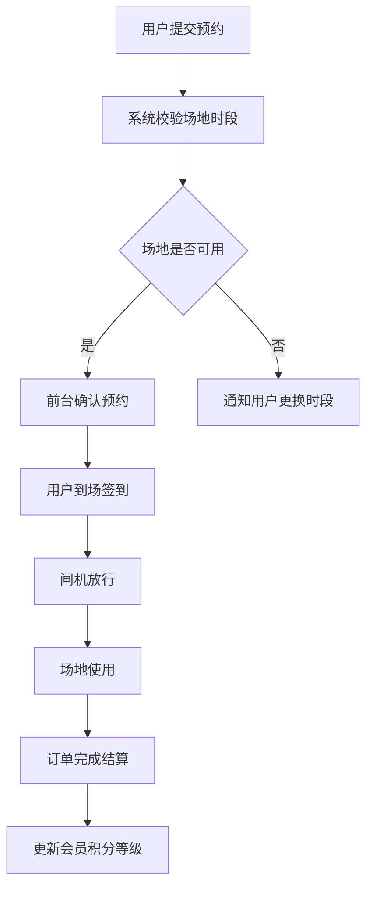

## 1. 产品概述

智慧体育场馆运营系统是面向体育中心管理人员的 Web 应用，集中管理篮球馆、羽毛球馆和游泳馆的日常运营服务。系统通过数字化手段实现场地排期、预约管理、会员运营、课程活动、设备巡检和收入分析的一体化管理，提升场馆运营效率和服务质量。

- 目标用户：体育中心运营管理人员、前台接待、财务人员
- 核心价值：减少人工排期冲突、提高场地利用率、规范会员服务体系、实现收入透明化管理

## 2. 核心功能

### 2.1 用户角色

| 角色 | 注册方式 | 核心权限 |
|------|----------|----------|
| 超级管理员 | 系统预设 | 全部功能访问、系统配置 |
| 场馆经理 | 管理员创建 | 场地管理、预约审核、报表查看 |
| 前台接待 | 管理员创建 | 预约处理、会员服务、签到核销 |
| 教练 | 管理员创建 | 课程发布、学员查看、签到管理 |

### 2.2 功能模块

1. **总览页面**：场地状态看板、实时客流统计、异常提醒中心、今日待办、核心运营指标
2. **场地排期页面**：分时段定价管理、临时锁场、团体包场、场地日历视图
3. **预约订单页面**：线上预约确认、订单管理、退款审核、投诉处理
4. **会员档案页面**：会员等级体系、储值扣费、会员信息管理
5. **课程活动页面**：教练课程发布、活动报名、签到核销
6. **设备巡检页面**：器材借还管理、保洁巡检记录、闸机放行记录
7. **收入报表页面**：收入对账、客流统计图表、经营分析

### 2.3 页面详情

| 页面名称 | 模块名称 | 功能描述 |
|----------|----------|----------|
| 总览 | 场地状态看板 | 实时展示篮球馆、羽毛球馆、游泳馆各场地的空闲/占用/维护状态，支持一键查看详情 |
| 总览 | 客流统计卡片 | 展示今日各场馆客流量、同比环比数据，趋势迷你图 |
| 总览 | 异常提醒中心 | 实时推送设备故障、投诉待处理、预约超时等异常事件，支持标记已读 |
| 总览 | 今日待办 | 展示今日待确认预约、待巡检任务、待处理退款等事项列表 |
| 总览 | 核心指标 | 今日收入、场地利用率、会员新增数、课程出勤率等关键数据 |
| 场地排期 | 场地日历视图 | 按周/日展示场地预约情况，支持拖拽调整排期 |
| 场地排期 | 分时段定价 | 设置工作日/周末/节假日的不同时段价格，支持批量设置 |
| 场地排期 | 临时锁场 | 一键锁定场地，填写锁场原因和预计恢复时间，解锁需确认 |
| 场地排期 | 团体包场 | 创建包场活动，设置包场时段、价格、联系人，支持批量预约 |
| 预约订单 | 线上预约确认 | 查看线上预约列表，逐条确认或批量确认，支持添加备注 |
| 预约订单 | 订单管理 | 全部订单列表，支持按场馆/状态/日期筛选，查看订单详情 |
| 预约订单 | 退款审核 | 退款申请列表，查看退款原因，审批通过/拒绝，支持部分退款 |
| 预约订单 | 投诉处理 | 投诉工单列表，指派处理人，跟踪处理进度，记录处理结果 |
| 会员档案 | 会员列表 | 会员信息列表，支持搜索、筛选、查看详情 |
| 会员档案 | 会员等级 | 配置等级规则（消费金额/次数自动升级），等级权益管理 |
| 会员档案 | 储值扣费 | 会员充值、扣费记录，余额查询，支持手动调整余额 |
| 课程活动 | 教练课程发布 | 创建课程（教练、时间、场地、人数限制、价格），发布/下架 |
| 课程活动 | 活动报名 | 创建运营活动（赛事、体验课等），查看报名列表，管理名额 |
| 课程活动 | 签到核销 | 扫码/手动签到，课程签到率统计，未签到自动标记 |
| 设备巡检 | 器材借还 | 器材库存管理，借还记录，逾期提醒，损耗登记 |
| 设备巡检 | 保洁巡检 | 巡检任务分配，巡检打卡，问题上报，整改跟踪 |
| 设备巡检 | 闸机放行记录 | 闸机通行记录查询，异常通行告警，会员进出统计 |
| 设备巡检 | 投诉处理 | 与预约订单页投诉处理联动，设备相关投诉工单 |
| 收入报表 | 收入对账 | 按场馆/日期/支付方式汇总收入，支持导出对账单 |
| 收入报表 | 客流统计 | 各场馆客流量趋势图、高峰时段分析，对比报表 |
| 收入报表 | 经营分析 | 场地利用率、会员消费趋势、课程收益等多维度分析 |

## 3. 核心流程

### 预约到入场流程
用户提交线上预约 → 系统自动检查场地可用性和时段价格 → 前台确认预约 → 用户到场签到核销 → 闸机放行 → 场地使用 → 订单完成

### 会员消费流程
会员选择场地/课程 → 系统根据会员等级计算折扣 → 储值余额扣费 → 生成消费记录 → 等级积分累计

### 设备巡检流程
系统生成巡检任务 → 巡检员打卡巡检 → 上报问题 → 指派整改 → 整改完成确认

## 4. 用户界面设计

### 4.1 设计风格

- 主色调：深蓝 #0F2B46（稳重专业），辅色：翠绿 #00C48C（活力运动），警告色：琥珀 #FF8C00
- 按钮风格：圆角 8px，主按钮带微妙渐变，hover 态带发光效果
- 字体：中文使用思源黑体，数字/英文使用 DM Sans，层级清晰
- 布局风格：左侧固定导航 + 右侧内容区，卡片式布局，数据可视化突出
- 图标风格：线条型 lucide 图标，2px 描边

### 4.2 页面设计概览

| 页面名称 | 模块名称 | UI 元素 |
|----------|----------|----------|
| 总览 | 场地状态看板 | 三列卡片布局（篮球/羽毛球/游泳），每个卡片内以色块网格展示场地实时状态，绿色空闲、红色占用、灰色维护 |
| 总览 | 客流统计卡片 | 数字 + 迷你折线图，同比环比箭头标识 |
| 总览 | 异常提醒中心 | 右侧滑出面板，带类型图标和紧急程度标签，脉冲动画提示 |
| 总览 | 今日待办 | 左侧列表，带优先级色条，点击展开详情 |
| 总览 | 核心指标 | 四宫格指标卡片，数字大字号突出，下方趋势小图 |
| 场地排期 | 场地日历视图 | 左侧场地列表 + 顶部时间轴 + 中间预约色块，可拖拽 |
| 场地排期 | 分时段定价 | 表格布局，时段行 × 场地列，价格可内联编辑 |
| 场地排期 | 临时锁场 | 模态框，红色锁图标，锁场原因文本域 + 时间选择 |
| 场地排期 | 团体包场 | 侧滑表单，选择场地+时段+价格+联系人 |
| 预约订单 | 线上预约确认 | 列表 + 操作栏，批量确认按钮，单条滑出详情面板 |
| 预约订单 | 退款审核 | 卡片式列表，退款金额醒目，通过/拒绝按钮带确认 |
| 预约订单 | 投诉处理 | 工单列表，状态标签（待处理/处理中/已关闭），进度时间轴 |
| 会员档案 | 会员列表 | 表格 + 搜索栏 + 等级筛选标签 |
| 会员档案 | 会员等级 | 等级卡片横排，展示等级图标/名称/折扣/升级条件 |
| 会员档案 | 储值扣费 | 余额展示卡片 + 充值/扣费操作按钮 + 交易流水列表 |
| 课程活动 | 教练课程发布 | 课程卡片网格布局，封面图 + 信息摘要，悬浮操作 |
| 课程活动 | 活动报名 | 活动详情页 + 报名名单表格 |
| 课程活动 | 签到核销 | 签到面板，待签到名单 + 签到按钮，签到率进度条 |
| 设备巡检 | 器材借还 | 器材分类标签 + 库存数量条 + 借还记录表格 |
| 设备巡检 | 保洁巡检 | 巡检日历 + 任务打卡按钮 + 问题上报表单 |
| 设备巡检 | 闸机放行记录 | 记录表格 + 会员头像 + 通行时间 + 异常标签 |
| 收入报表 | 收入对账 | 顶部汇总数字 + 按场馆分组柱状图 + 明细表格 |
| 收入报表 | 客流统计 | 折线图 + 高峰时段热力图 + 对比数据表格 |
| 收入报表 | 经营分析 | 多图仪表盘布局，环形图/柱状图/趋势图组合 |

### 4.3 响应式设计

- 桌面优先设计，最小宽度 1280px
- 侧边栏在 1440px+ 时展开，1024-1440px 时可折叠
- 内容区在窄屏时卡片从多列自适应为单列
- 表格在窄屏时支持横向滚动

### 4.4 3D 场景

不适用
