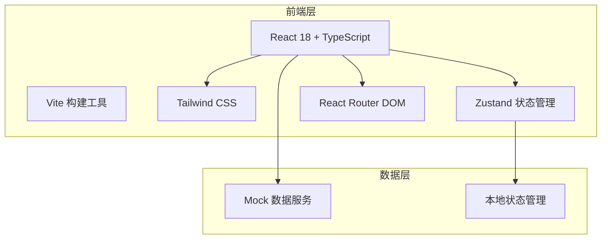
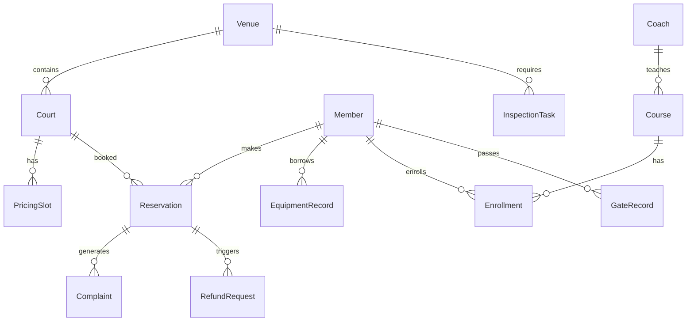

## 1. 架构设计



## 2. 技术说明

- 前端：React@18 + TypeScript + Tailwind CSS@3 + Vite
- 初始化工具：vite-init
- 后端：无（纯前端项目，使用 Mock 数据）
- 数据库：无（使用内存 Mock 数据模拟）
- 状态管理：Zustand
- 图表库：recharts
- 图标库：lucide-react
- 日期处理：date-fns

## 3. 路由定义

| 路由 | 用途 |
|------|------|
| / | 总览页面 - 场地状态看板、客流统计、异常提醒、今日待办 |
| /schedule | 场地排期 - 分时段定价、临时锁场、团体包场、日历视图 |
| /orders | 预约订单 - 线上预约确认、退款审核、投诉处理 |
| /members | 会员档案 - 会员列表、等级管理、储值扣费 |
| /courses | 课程活动 - 教练课程发布、活动报名、签到核销 |
| /inspection | 设备巡检 - 器材借还、保洁巡检、闸机放行记录 |
| /finance | 收入报表 - 收入对账、客流统计、经营分析 |

## 4. API 定义

本项目为纯前端应用，使用 Mock 数据模拟后端接口。数据通过 Zustand store 管理。

### 核心数据类型

```typescript
interface Venue {
  id: string
  name: string
  type: 'basketball' | 'badminton' | 'swimming'
  courts: Court[]
  status: 'open' | 'closed' | 'maintenance'
}

interface Court {
  id: string
  venueId: string
  name: string
  status: 'available' | 'occupied' | 'locked' | 'maintenance'
  pricingSlots: PricingSlot[]
}

interface PricingSlot {
  id: string
  courtId: string
  dayType: 'weekday' | 'weekend' | 'holiday'
  startTime: string
  endTime: string
  price: number
}

interface Reservation {
  id: string
  courtId: string
  userId: string
  date: string
  startTime: string
  endTime: string
  status: 'pending' | 'confirmed' | 'cancelled' | 'completed'
  totalPrice: number
  paymentMethod: string
  createdAt: string
}

interface Member {
  id: string
  name: string
  phone: string
  level: 'bronze' | 'silver' | 'gold' | 'platinum'
  balance: number
  totalSpent: number
  visitCount: number
  registeredAt: string
}

interface Course {
  id: string
  coachId: string
  title: string
  venueId: string
  schedule: string
  capacity: number
  enrolled: number
  price: number
  status: 'active' | 'inactive'
}

interface InspectionTask {
  id: string
  type: 'cleaning' | 'equipment' | 'gate'
  assignee: string
  venueId: string
  scheduledAt: string
  status: 'pending' | 'in_progress' | 'completed'
  issues: string[]
}

interface Complaint {
  id: string
  orderId: string
  userId: string
  category: string
  description: string
  status: 'open' | 'processing' | 'resolved' | 'closed'
  assignee: string
  createdAt: string
  resolvedAt: string
}

interface RefundRequest {
  id: string
  orderId: string
  amount: number
  reason: string
  status: 'pending' | 'approved' | 'rejected'
  createdAt: string
}

interface GateRecord {
  id: string
  memberId: string
  memberName: string
  gateId: string
  direction: 'in' | 'out'
  timestamp: string
  isAbnormal: boolean
}

interface EquipmentRecord {
  id: string
  equipmentName: string
  type: 'borrow' | 'return'
  memberId: string
  memberName: string
  timestamp: string
  condition: 'good' | 'damaged'
}
```

## 5. 服务端架构

不适用（纯前端项目）

## 6. 数据模型

### 6.1 数据模型定义



### 6.2 数据定义语言

本项目使用 Mock 数据，无需 DDL。
